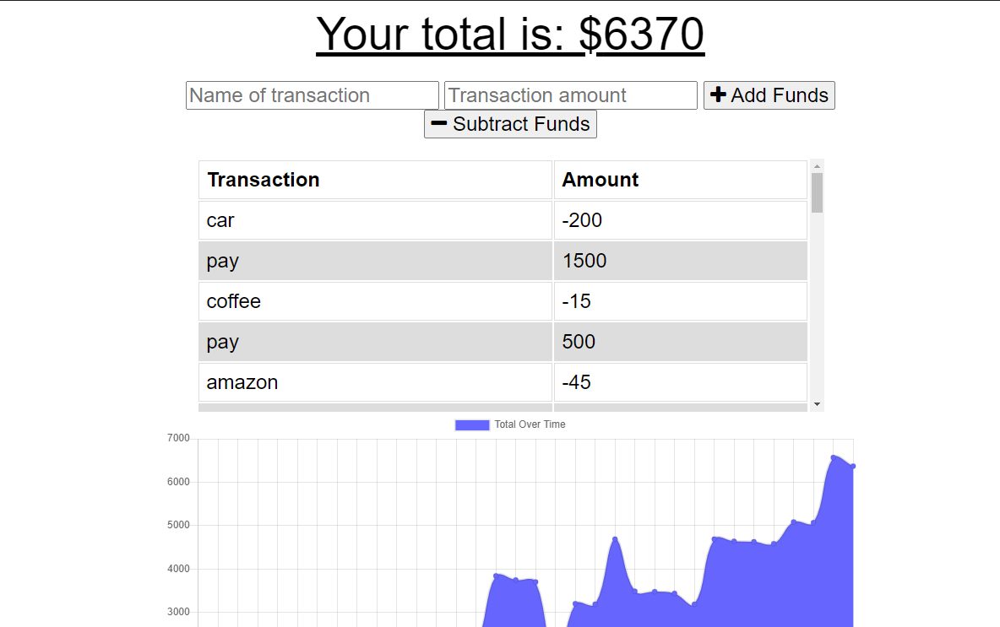

## My Budget Tracker

# Link to deployed website:
https://mybudgettracker-mf.herokuapp.com/

# Link to repo:
https://github.com/myrlaf25/mybudgettracker

</img>

## Table of Contents

-[Description](#description)
-[Installation](#installation)
-[Usage](#usage)
-[Credits](#credits)
-[License](#license)
-[Tests](#tests)

# Description
This is a budget tracker application. The front end code was provided by Trilogy. This app will help the user to keep track of their budget with or without a connection. When entering transactions offline, the app will populate the total/changes when brought back online. The user may enter transactions such as deposits and expenses. 

# User Story
* As a user and an avid traveller
I WANT to be able to track my withdrawals and deposits with or without a data/internet connection
SO THAT my account balance is accurate, when I am traveling.
    # PWA-Budget Tracker
</img>

## Business Context
The user will have access to track their money, allowing them to access that information anytime, either online or offline. 

## Installation
The user will have to install the following: compression, express, lite-server, mongoose, morgan. Morgan will show the user the log of all commands in the terminal such as GET and POST. The app is using IndexedDB for the offline functionality. The app was deployed using MongoDB Atlas and Heroku. 

## Usage
When the user loads the page, it will allow the user to enter transactions such as deposits or expenses in order to keep track of their monies. 

## Credits
Trilogy provided started code. I worked on creating the manifest, service worker, adding the indexedDB component, downloading all packages neccesary. I also used MongoDB to create the database for deployment in Heroku. 

## License

For more information on the License, please click on the link: 
-[License] https://opensource.org/licenses/ISC

## Tests
## Tests
Once the user enters the command in the terminal of nodemon server or node server.js, the user may utilize Insomnia Core to check the functionality. The API routes: GET will pull all the infromation available and the POST is to enter new infromaiton into the app. 

-[GitHub] {https://github.com/myrlaf25}

##Questions
To contact me directly, please email me at: myrlaf25@gmail.com.
